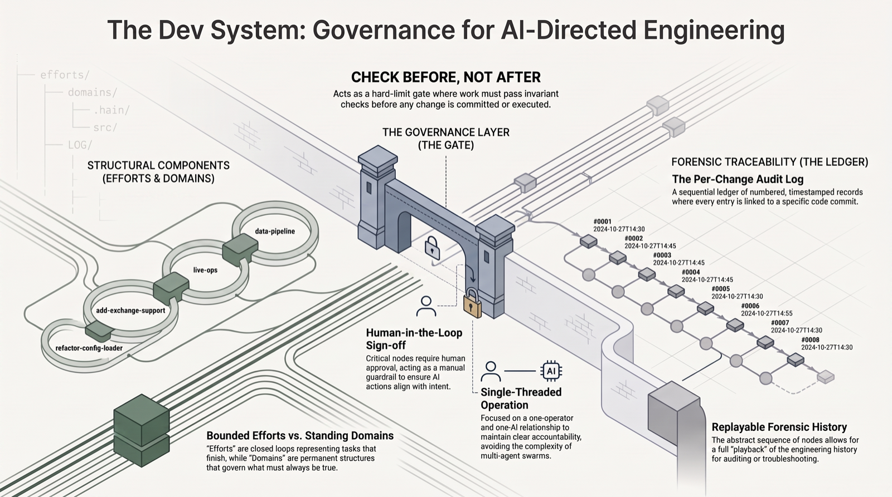
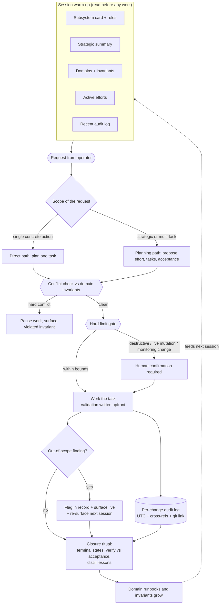

# Dev System

**A governance and audit method for building and operating software with AI.**


> When you direct AI to build and operate real systems, the code generation is the easy part. The hard part is the discipline around it: what gets validated before it is called done, what can never be violated, what every change is logged against, and what the AI is never allowed to do alone. This repository documents that discipline.

---

## What it is

Dev System is a structured working method for building and operating software with AI while keeping a clean, forensic audit trail. It lives inside a plain Obsidian markdown vault and organizes work into two shapes: **bounded efforts** that open, run, and close, and **standing domains** that hold the invariants a system must never violate. Every material change is logged against its effort and domain with a link to the commit, a small set of actions is permanently off-limits to autonomous execution, and nothing is marked done until its acceptance criteria are actually exercised.

The frame is not "a tidy note-taking setup." It is the governance and audit layer that makes AI-assisted engineering safe to run against production and reconstructable after the fact.

---

## What is real, what is sanitized

- **Real:** this method runs privately over a live production system I operate around the clock, where it has governed AI-assisted changes for more than two months of continuous use. That instance is the validation case, not a thought experiment.
- **Sanitized:** what ships in this repository is a runnable sample of the method, not the instance. Every effort, domain, and log entry shown here is generic and invented (`refactor-config-loader`, `add-exchange-support`, `venue-beta`, `data-pipeline`). No real work items, no system internals, no operational specifics of the systems it governs. What is on display is the shape and the rigor, deliberately separated from anything private.

---

## What it looks like

These are live files from the `sample-subsystem/` that ships in this repo, shown inline. Authentic content, not a screenshot.

```text
_dev/
├── SUMMARY.md
├── LOG/
│   ├── LOG.md
│   ├── 0451-config-loader-schema-migration.md
│   └── 0452-add-venue-beta-connector.md
├── efforts/
│   ├── efforts.md
│   ├── refactor-config-loader/
│   │   └── refactor-config-loader.md
│   └── add-exchange-support/
│       └── add-exchange-support.md
├── domains/
│   ├── domains.md
│   └── data-pipeline/
│       └── data-pipeline.md
└── +inbox/
    └── +inbox.md
```

**What to look at:** the two-shape structure. Efforts that close and domains that persist, sitting next to a per-change LOG and a small local capture inbox. One glance tells you what is bounded work and what is a standing rule.

| # | Title |
|---|---|
| 452 | 🔌 venue-beta connector against shared ingestion contract, UTC normalized at boundary |
| 451 | 🧱 Config loader onto versioned schema v2, legacy path preserved |

**What to look at:** the audit index. Every material change is a numbered, timestamped row, generated automatically from frontmatter, each one cross-linked to its effort, its domain, and its git commit. The full diff is one click away from any line.

```markdown
# Refactor config loader

## Goal
Move the pipeline config loader onto an explicit, versioned schema so new venues
and stages can be added declaratively. Old config files must keep parsing.

## Acceptance
Written before the work; closure verifies against these.
- Schema v2 parses every existing config fixture without error.
- Old (unversioned) config files still parse through a backward-compat path.
- Loader rejects unknown top-level keys with a clear message.

## Tasks
### ✅ CFG-001 – introduce a `schema_version` field and a v2 parser
### ✅ CFG-002 – strict unknown-key rejection
### ▶️ CFG-003 – backward-compat path for legacy configs
### ❓ CFG-004 – migration helper to rewrite v1 files as v2 🚩

## Closure
[Filled at the closure ritual: what shipped, key decisions, deferred items, and
lessons promoted into domain runbooks. Not filled while the effort is active.]
```

**What to look at:** acceptance criteria written *before* the work, task states that include partial, failed, and killed as first-class outcomes, and a closure section that only gets filled once the effort has been verified against those criteria.

---

## How it works

The architecture is a set of deliberate decisions, not a framework. Each one exists because the alternative failed in practice.

**1. Two shapes for work.** Efforts are deadline-bound and goal-shaped; they carry a Goal, an Acceptance section, tasks, and a Closure note, and then they archive. Domains are ongoing and invariant-shaped; they never close and they hold the rules a system must keep. This is a small recursive PARA structure living underneath the outer knowledge base, with intentionally different names so the two layers never blur.

**2. Acceptance is written before the work.** Every non-trivial task carries validation criteria at the moment it is created, not retrofitted at the end. This closes the most common failure of agentic work: marking something a success when the checks were never actually run.

**3. Invariants are a gate, not a wish list.** Before new work starts, it is evaluated against the active domain invariants. A soft overlap is flagged and proceeds; a hard conflict blocks the work, which is parked in a paused state with the violated rule cited inline and surfaced to a human. Invariants grow from real incidents, not from a theoretical ceiling of rules.

**4. Every change is logged against a source of truth.** One LOG entry per material change: a UTC timestamp to the minute, cross-references to the effort, domain, and task it touched, and a link to the commit. The body stays to a few sentences because the diff carries the detail. The result is a trail you can replay forensically months later.

**5. A few actions are permanently off-limits to autonomy.** Destructive operations, live-system mutations, and any change to monitoring or alerting always require a human, even when the AI could act faster. Acting first is allowed only when harm is imminent and the correct action is unambiguous; anything short of that gets confirmed, because the cost of a wrong irreversible move dwarfs the cost of one extra turn.

**6. Terminal states are honest.** A seven-state task palette makes partial, failed, and killed visible and first-class, so the record reflects what actually happened rather than an optimistic flag flip.

| Glyph | State | Meaning |
|---|---|---|
| ▶️ | active | work in motion |
| ✅ | verified | objective met, all validation exercised |
| ⏸️ | paused | transient block, will resume |
| ❓ | partial | shipped but incomplete, carry-forward stated |
| ❌ | failed | objective not achieved, accepted as a known limit |
| 🪦 | killed | explicit decision to abandon, with rationale |
| 🔁 | recurring | standing obligation, never terminal |

**7. Closure is a ritual.** An effort closes only after every task reaches a terminal state, an optional integration-level check runs when the effort touched shared state, the goal and acceptance criteria are reviewed against evidence with a human, and the durable lessons are distilled into domain runbooks. It is a sign-off, not a status change.

**8. No finding disappears silently.** An out-of-scope observation the AI makes mid-work is surfaced live, flagged in the record, and re-surfaced at the next session start. Defense in depth by design: a live channel, a persistent flag, and a session-start digest, so an insight never falls through a crack.

### The flow



### The layout

This is the actual tree of the sample that ships here (`sample-subsystem/`), alongside a
`docs/pattern-overview.md` that describes the method in prose. A subsystem carries more domains
in real use; the sample instantiates one so the shape stays legible.

```
sample-subsystem/                 the demonstrated subsystem (a git repo root in real use)
├── CLAUDE.md                     subsystem-specific rules (auto-loaded at session start)
├── sample-subsystem.md           the vault-facing card: the only surface the outer system reads
└── _dev/                         the dev layer (private to the subsystem)
    ├── SUMMARY.md                strategic state, kept short
    ├── LOG/                      per-change audit trail (one entry per material change)
    │   ├── LOG.md                live index (Bases query over the entries)
    │   ├── 0451-config-loader-schema-migration.md
    │   └── 0452-add-venue-beta-connector.md
    ├── efforts/                  bounded work that opens, runs, and closes
    │   ├── efforts.md            container index (soft cap: 4 active)
    │   ├── refactor-config-loader/
    │   └── add-exchange-support/
    ├── domains/                  standing concerns that hold invariants
    │   ├── domains.md            container index
    │   └── data-pipeline/
    └── +inbox/                   local capture, triaged later
```

Closed efforts and retired domains move to a dated `_dev/_archive/` (empty in this sample, since
nothing has closed yet).

---

## Stack

Deliberately light. The method leans on plain files and a few small tools rather than a framework.

- **Obsidian markdown vault:** the substrate. Every artifact is a plain markdown file, so everything is greppable, diff-able, and outlives any tool.
- **Folder-note convention:** each container and each item folder carries its own note, so structure and content share one surface.
- **Bases query layer:** renders the LOG as a live, sortable audit index straight from frontmatter, with no hand-maintained table to drift.
- **Tasks plugin:** handles recurrence math for the standing obligations that live inside their domain.
- **Git:** the parallel source of truth for what changed. LOG entries cite commits, so the full diff sits one click from any audit line.
- **Claude Code:** the AI collaborator this method is designed to direct and constrain.
- **Optional operational hooks:** the live instance adds lightweight signals around the method, such as a scheduled check that pings the operator when the audit log goes quiet for longer than expected. None ship in this sample; they are noted for completeness.

---

## How correctness is enforced

Correctness here is a discipline, not a test suite. The machinery is built to make "done" mean something.

- **Acceptance upfront.** Validation criteria are written when a task is created. A task is marked verified only when those criteria are actually exercised; otherwise it becomes partial, with the carry-forward stated in plain text. This prevents success from being retrofitted onto work that was never checked.
- **Status against evidence.** Before a closure is put in front of a human, the AI reconciles each task's status against its evidence and downgrades anything that does not hold. The human's job is to catch what that self-check missed, not to rubber-stamp it.
- **Integration verification.** Substantial efforts get an end-to-end check across their deliverables before they are allowed to close, above and beyond per-task validation, especially when the work touched shared state.
- **Conflict checking before, not after.** New work is evaluated against active invariants at creation time. A violation blocks the work rather than surfacing as a regression later.
- **A trail you can replay.** Any change is reconstructable from the LOG plus git history, ordered to the minute, with the reasoning captured next to the diff.

---

## What it deliberately is not

Scope discipline is part of the design. The method resists the features that usually bloat systems like this.

- **Not a multi-agent orchestration.** One operator, one AI, one thread. No personas, no message bus.
- **Not a packaged framework or CLI.** It is a working method over markdown and git, not a tool to install, and it is framework-agnostic on purpose.
- **Not a machine-enforced schema.** The checking is cognitive and a human owns the boundary; there are no linting gates pretending to be judgment.
- **Not branch-per-task machinery.** Single branch, one source of truth per task, no orchestration layer to maintain.

---

## How it is built

I work AI-first: I direct tools like Claude Code to do the mechanical build work, and this method is the frame that keeps that work auditable, honest about its own state, and safe to run against production.

---

## Status and contact

**Tier:** Reference. **Status:** validated over more than two months of continuous live use governing AI-assisted changes on a production system I operate around the clock.

This is one piece of a broader portfolio of production AI systems (agents, MCP servers, retrieval, and self-hosted platforms).

- Portfolio: [github.com/janvrsinsky](https://github.com/janvrsinsky)
- LinkedIn: [linkedin.com/in/janvrsinsky](https://linkedin.com/in/janvrsinsky)
